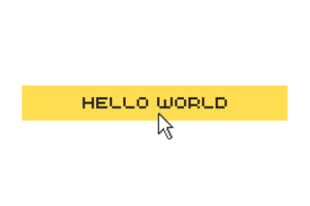

  

### A Little Bit About Me
- 👀 I really like solving problems specifically when it comes into the realm of tech.
- 🐧 Ubuntu is my primary Linux distributution, But I still use windows here and there.
- 📚 Really love to learn new things. Like a lot!
- 🏂 I have a love hate relationship with such low temperature. 
- 👩‍💻 I also like to hack. Ethically of course.
---

### Language & Tools

  

---
### Github Overview

    

    

